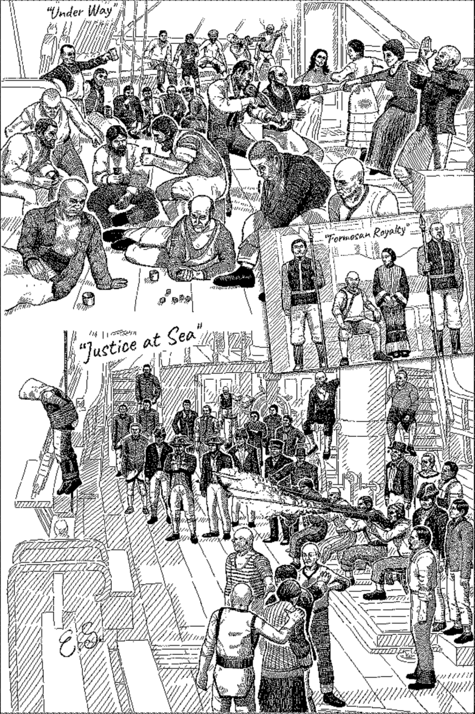
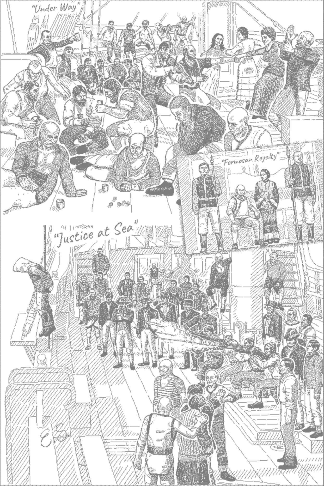
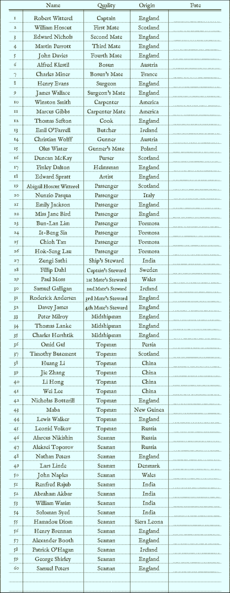
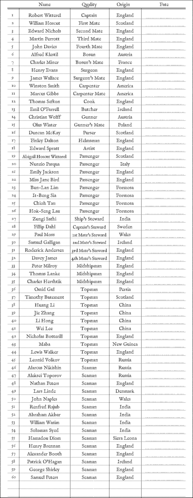
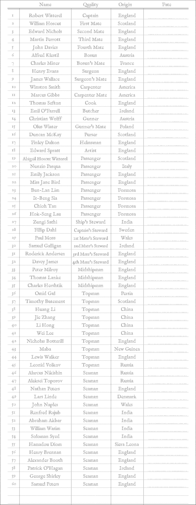
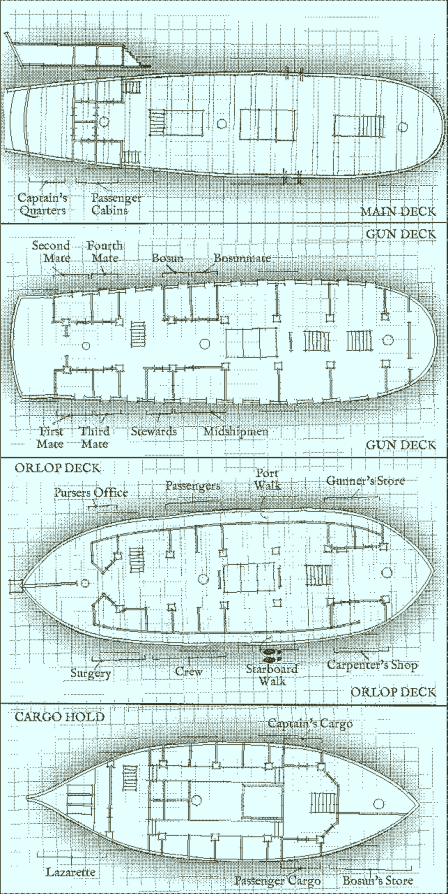
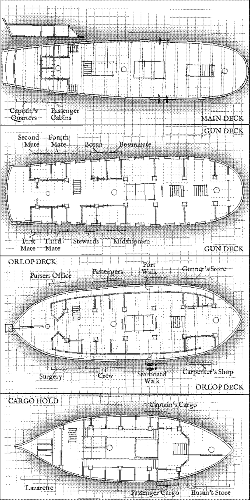
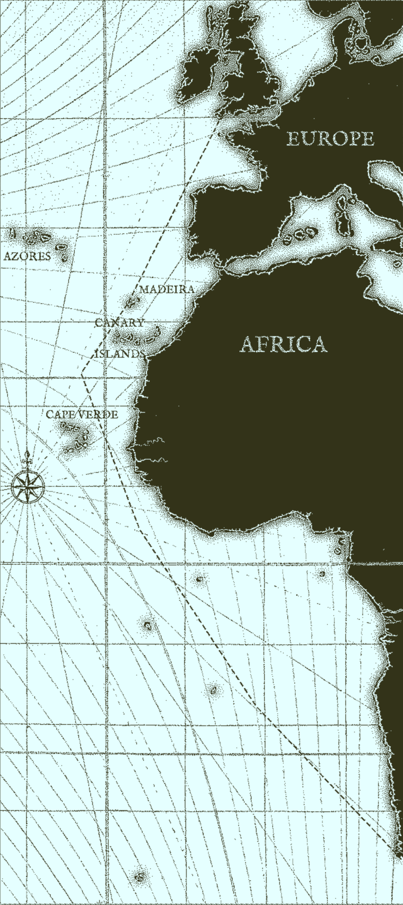
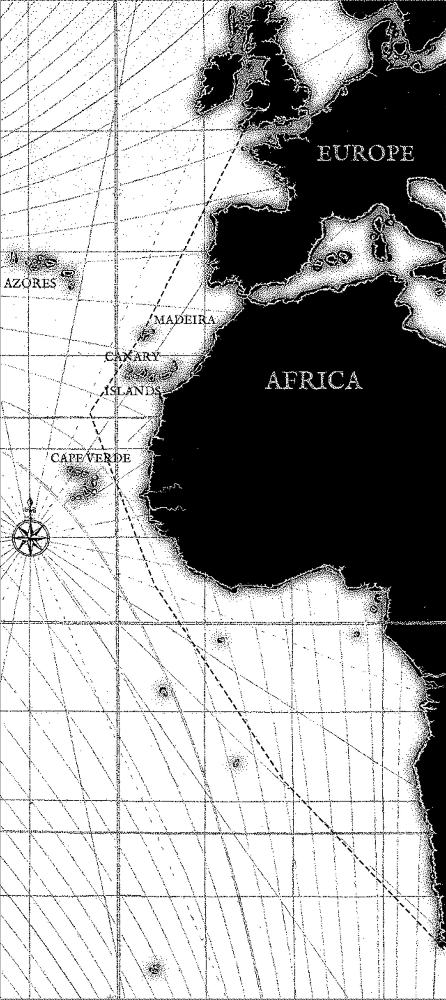

# Printouts for The Return of the Obra Dinn

Recently started the game and quickly realized that notetaking would be pretty much necessary given the amount of people and events in the game. Constantly opening and closing the manifest/sketch/maps was getting boring so I thought about printing them for easy notetaking and to make things easier to reference to my notes.

While the images are online they usually aren't printer friendly because of the color schemes so I grabbed them and ran some post-processing to turn them to grayscale and a dimmer-grayscale to make writing on top easier.

| Sketch | Original    | Grayscale   | Dim Grayscale |
| --- | :---:       |    :----:   |         :---: |
| Life at Sea  |  |  |  |
| The Crew     |  |  |  |
| The Ship     |  |  |  |
| The journey  |  |  |  |

## PDF

I ended up putting together everything into a pdf for easy of printing, it can be found [here](https://github.com/JJGO/obra-dinn-printouts/blob/main/obra-dinn.pdf).
