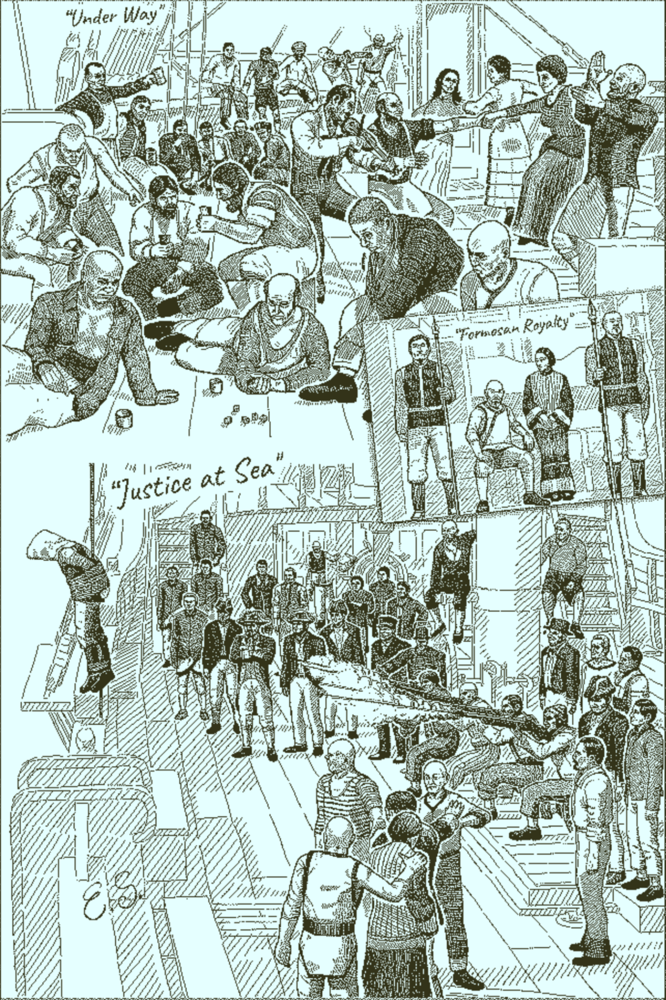
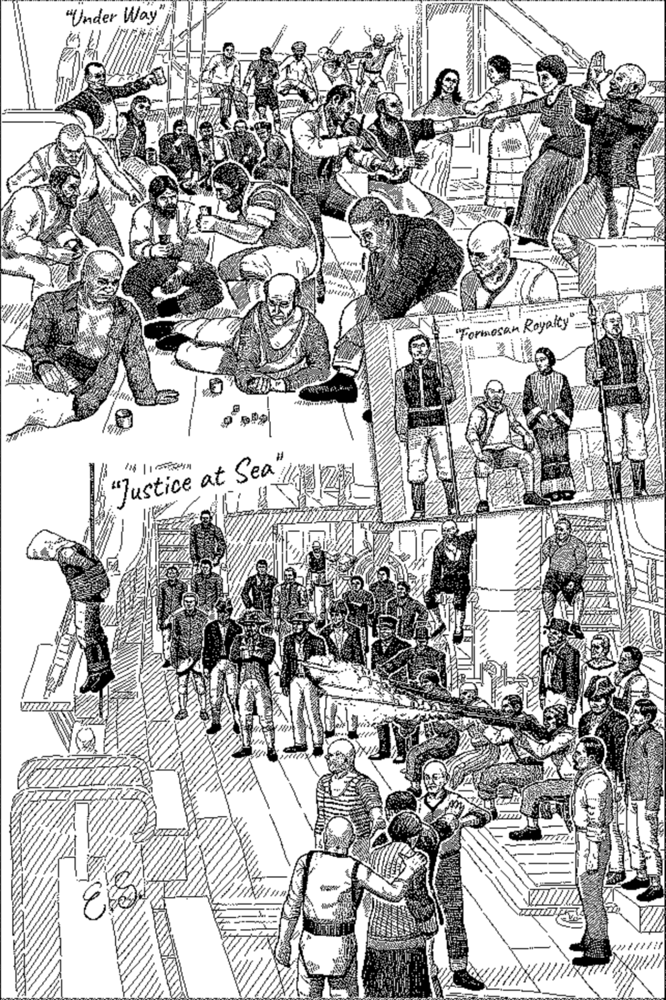
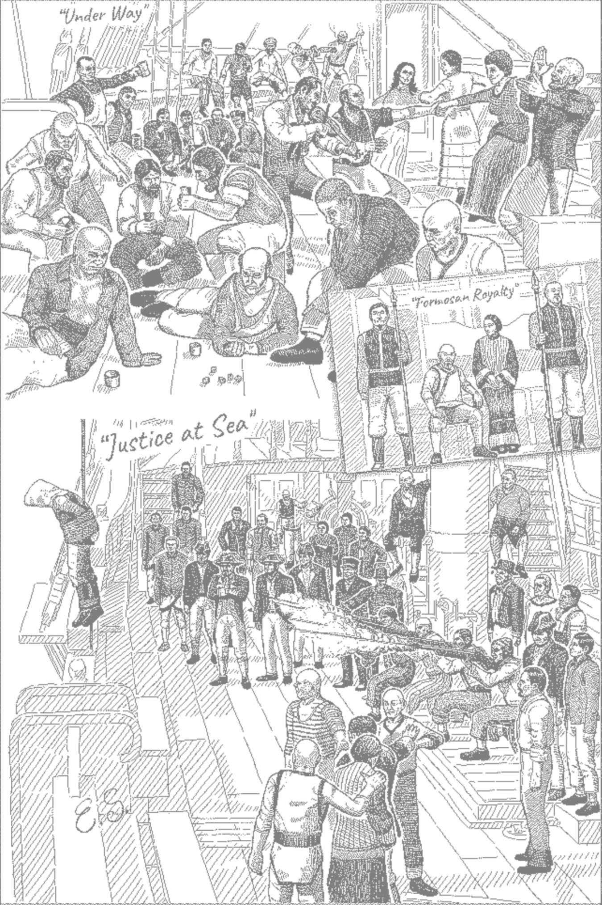
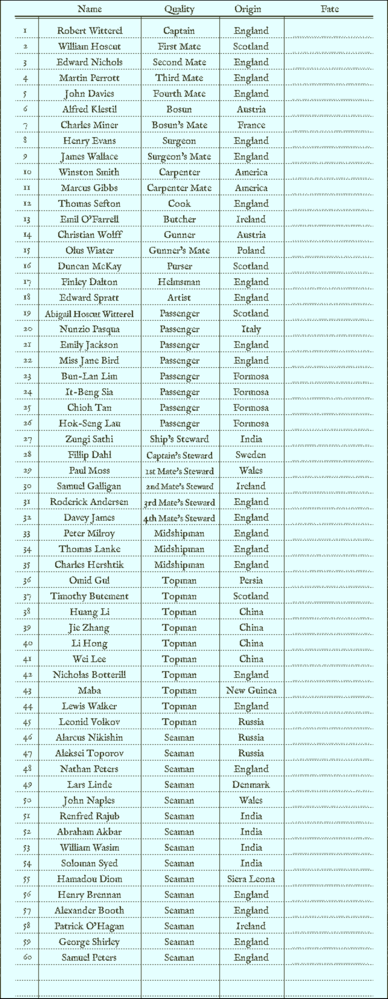
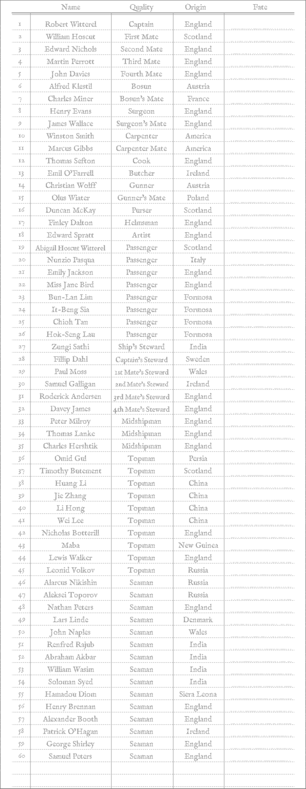
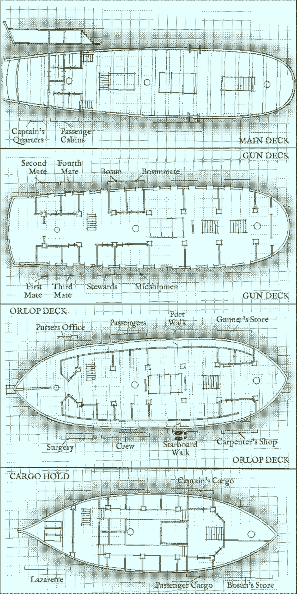
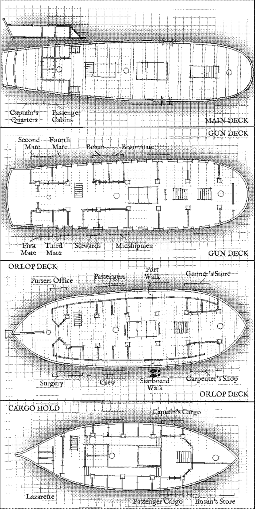
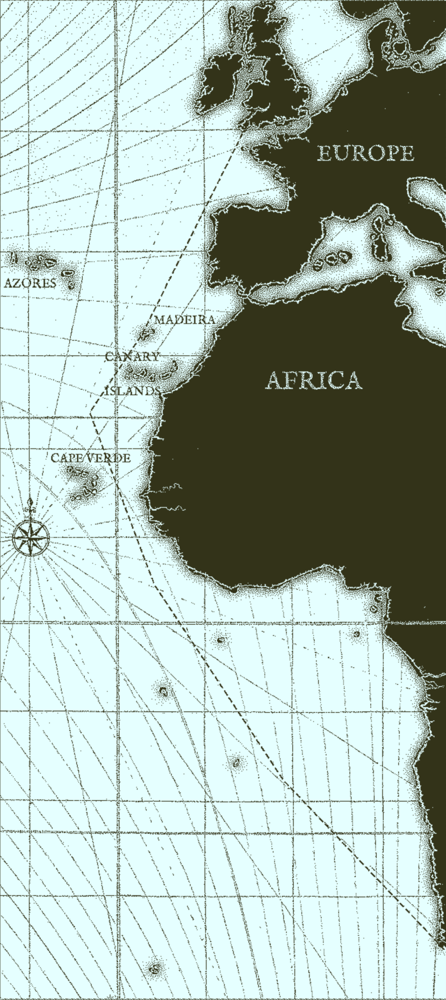
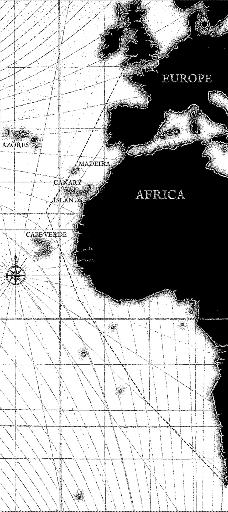

# Printouts for The Return of the Obra Dinn

Printer friendly versions of the supporting materials for the videogame The Return of the Obra Dinn.
These versions can be printed with a black and white or color printer to make note taking and referencing information easier.
The light grayscale versions are intended to write on top of them, specially handy for the _Life at Sea_ and _The Ship_.
A PDF with cropped versions of the _The Crew_ and _The Journey_ is also included 

<a href='https://raw.githubusercontent.com/JJGO/obra-dinn-printouts/main/printouts/obra-dinn.pdf'>

  
 Letter Paper 

</a>

  
---
  
| Sketch | Original    | Grayscale   | Light Grayscale |
| --- | :---:       |    :----:   |         :---: |
| Life at Sea  |  |  |  |
| The Crew     |     |     |  |
| The Ship     |     |     |  |
| The Journey  |  |  |  |
